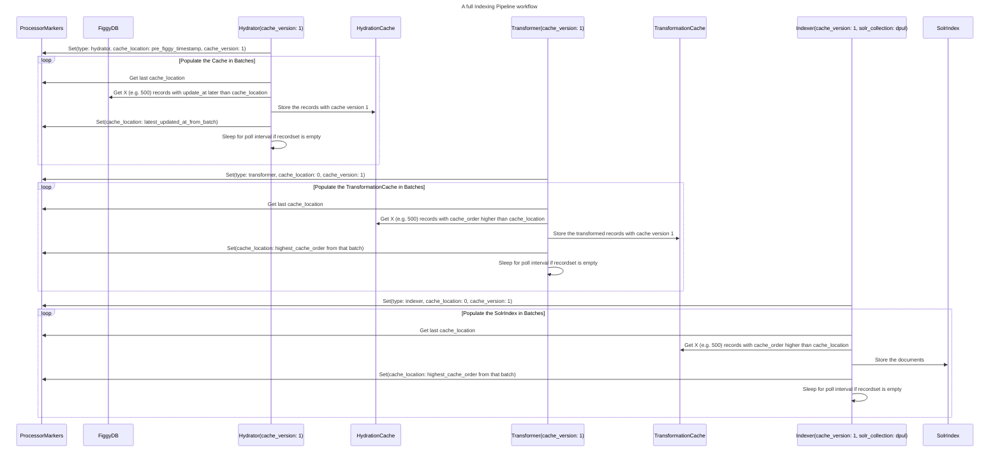

# 2. Indexing Architecture

Date: 2024-07-09

## Status

Accepted 2024-07-09
Updated 2025-10-21

## Context

DPUL-Collections must have a resilient indexing pipeline that can quickly harvest, transform, and index records. We foresee needing to process millions of records, regularly change weighting algorithms, and accept records from external institutions which may not be stable in the long term.

We will initially pull data from Figgy, so the performance requirements in this document are based on the size of Figgy's database.

Often times systems like this use event streaming platforms such as Kafka, but we'd like to prevent adding new technology to our stack. Instead we'll use Postgres to cache our data.

Many of the ideas and concepts that led to this architecture were introduced to us in [Designing Data Intensive Applications](https://catalog.princeton.edu/catalog/99127097737806421).

## Decision

Our indexing pipeline will consist of three steps - Hydration, Transformation, and Indexing. Collectively we'll call these the Processors. 

Each step has a performance requirement - the lower bound is the point at which we stop optimizing in the case of running that full process, the upper bound is the maximum we'll allow it to take before re-architecting

For newly added records (not a full pipeline run of all records), we expect to see changes within five minutes of persistence in Figgy, as our stakeholders often do patron requests by "Completing" a record in Figgy and then sending a resource to a patron. They shouldn't have to wait more than 5 minutes to do that.

### Hydration

The Hydrator will query Figgy's `orm_resources` table for newly updated records and copy them into a local postgres cache (the Hydration Cache). This pattern will allow us to do the transformation and indexing steps no matter the uptime or performance characteristics of our source repository.

The Hydration Cache has the following structure:

| id   | data  | cache_order | cache_version | record_id | source_cache_order | related_ids | source_cache_order_record_id |
|------|-------|-------------|---------------|-----------|--------------------| ----------- | -------------------------- |
| INT  | BLOB  | DATETIME    | INT           | VARCHAR   | DATETIME           | VARCHAR[]   | VARCHAR                      |

`related_ids` is used to make sure we can update a given record when its related records change. Given this requirement, `cache_order` is populated by the latest datetime between the record itself and all its related records. `source_cache_order_record_id` records the record id that is used to populate `cache_order`.

We'll pull records as well as DeletionMarkers so we'll know and record when records have been deleted from Figgy.

#### Performance Requirements for Full Hydration

1 Hour - 2 Days

##### Performance Reasoning

The faster we can do a full re-harvest, the faster we can pull in broad metadata changes from upstream (such as new Figgy or Bibdata data.) We want these kinds of tickets to have at most two days of delay.

### Transformation

The Transformer will query the Hydration Cache to fetch the records cached by the Hydration step, convert them to a Solr document, and store that solr document in a local postgres cache (the Transformation Cache) with the following structure:

| id   | data  | cache_order | cache_version | record_id | source_cache_order |
|------|-------|-------------|---------------|-----------|--------------------|
| INT  | BLOB  | DATETIME    | INT           | VARCHAR   | DATETIME           |

#### Performance Requirements for Full Transformation

30 minutes - 2 hours

##### Performance Reasoning

We will need to do a re-transformation when we add new fields to the index, which we expect to do often. The faster we can do that, the more of those tickets we can do. With a two hour transformation stage we can do more than one such transformation per day, significantly improving our productivity.

### Indexing

The Indexer will query the Transformation Cache to fetch the records cached by the Transformation step and index them into Solr as a batch.

#### Performance Requirements for Full Indexing

10 minutes - 1 hour

##### Performance Reasoning

We expect reindexing to need to happen often - either because of changing weights in Solr, migrating Solr machines, or testing new configurations. By tightening up this time as much as possible we can try many different weights in a day, supporting our vision of being able to create a joyful discovery experience. We believe this performance estimate is reasonable given that there won't be any transformation necessary - it will go as fast as Solr can accept documents.

## Sequence Diagram

## Commonalities between Processors

Each Processor will keep track of the last object they acted on in a ProcessorMarkers table with the following structure:

| id   | cache_location | cache_version | type    |
|------|----------------|---------------|---------|
| INT  | DATETIME       | INT           | VARCHAR |

- For Hydrator, `cache_location` is an `updated_at` value from the Figgy database.
- For Transformer, `cache_location` is a `cache_order` value from the HydrationCache
- For Indexer, `cache_location` is a `cache_order` value from the TransformationCache

The value of `cache_version` will be the same for each Processor within a given pipeline. It will be configured manually before a full pipeline run. It will be used to read the correct rows out of each cache.

## Concurrent Logic

To support concurrency in these processes we will use the source_cache_order field as an optimistic lock.

- When writing to a cache, the processor will do an upsert with a query like `INSERT INTO hydration_cache(data, cache_order, cache_version, record_id, source_cache_order) VALUES ('{}', NOW(), 1, '1da0340e-df0d-47cb-9567-4049e26141d9', <updated_at_from_figgy>) ON CONFLICT (record_id, cache_version) DO UPDATE SET cache_order = NOW(), data = '{}', source_cache_order = <updated_at_from_figgy> WHERE source_cache_order <= <updated_at_from_figgy>`
    * If there's already a row for the above record_id and cache_version, it will update it, meaning that there's only ever one row  per record_id in the cache.
    * If we're running an update for something from the cache that's older than the current state, it won't update the row - a more recent event already ran. This means we can process the cache in any order and at any level of parallelization.
    * If we're re-running a process because we've reset the cache_order in the ProcessorMarkers table, then it will write new records because it allows updating rows where source_cache_order is equal.

## Resilience and Error Handling 

The system will have a way to automatically retry errors caused by system downtime, and log errors caused by bugs in our code.

## Consequences

The caches will contain every deleted figgy resource.

Keeping track of three different tables may be complicated. However, we expect to be able to scale this architecture out to allow for multiple harvest sources and transformation steps in the future.

Handling Transformer errors at first will require a lot of DLS intervention. We might change that in the future, but we want to get a handle on the kinds of errors that are happening and record the kinds of automatic interventions that might be useful to implement.

Two of the new tables (the Caches) could be very large, requiring more disk space - each containing every resource we're indexing into Solr. However, we think they're necessary to meet our performance and reliability goals.

We're relying on Figgy having a single database we can harvest from. If Figgy's database architecture or schema change, we'll have to change our code.
