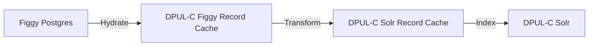
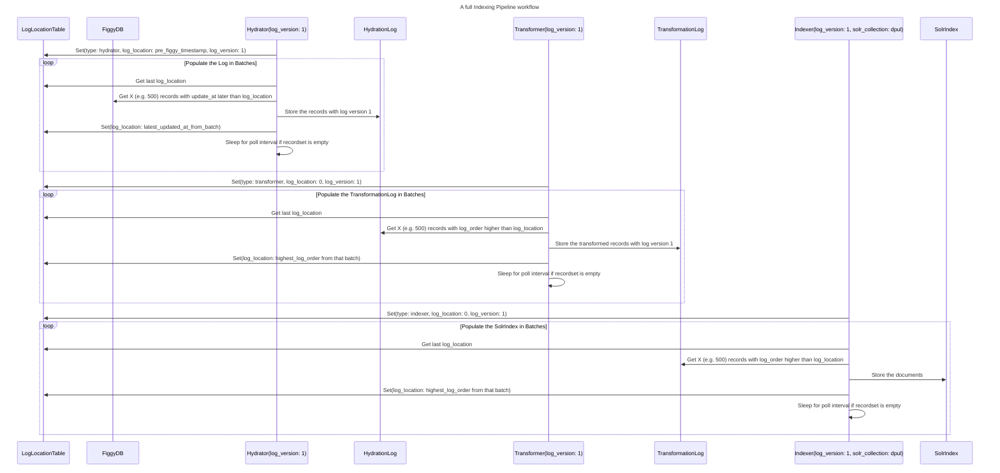

# 2. Indexing Architecture

Date: 2024-07-09

## Status

Accepted

## Context

DPUL-Collections must have a resilient indexing pipeline that can quickly harvest, transform, and index millions of records. We foresee needing to index millions of records, regularly change weighting algorithms, and accept records from external institutions which may not be stable in the long term.

There must be a verifiable method of ensuring that 100% of Figgy's relevant records are indexed into DPUL-Collections, to prevent us from constantly scrambling and diagnosing indexing issues as we do now with our spotlight-powered DPUL.

We will be starting with indexing from Figgy, so that's where our initial performance requirements will be based upon.

Often times systems like this use event streaming platforms such as Kafka, but we'd like to prevent adding new technology to our stack. We think we can use Postgres tables as a compact event log.

## Decision

Our indexing pipeline will consist of three steps - Hydration, Transformation, and Indexing.

Each step has a performance requirement - the lower bound is the point at which we stop optimizing in the case of running that full process, the upper bound is the maximum we'll allow it to take before re-architecting.

For newly added records (not a full pipeline run of all records), we expect to see changes within five minutes of persistence in Figgy, as our stakeholders often do patron requests by "Completing" a record in Figgy and then sending a resource to a patron. They shouldn't have to wait more than 5 minutes to do that.

### Hydration

Hydration will copy records from Figgy and place them into a cache in DPUL-Collections. This pattern will allow us to do the transformation and indexing steps no matter the uptime or performance characteristics of our source repository.

The Hydrator will query Figgy's `orm_resources` table for newly updated records and copy them into a local postgres cache that has the following structure:

| id   | data  | log_order | log_version | record_id |
|------|-------|-----------|-------------|-----------|
| INT  | BLOB  | INT       | INT         | VARCHAR   |

We'll pull records as well as DeletionMarkers so we'll know and record when records have been deleted from Figgy.

#### Performance Requirements for Full Hydration

1 Hour - 2 Days

##### Performance Reasoning

The faster we can do a full re-harvest, the faster we can pull in broad metadata changes from upstream (such as new Figgy or Bibdata data.) We want these kinds of tickets to have at most two days of delay.

### Transformation

The Transformer will query the hydration log to fetch the records cached by the Hydration step, convert them to a Solr document, and store that solr document in a local postgres cache with the following structure:

| id   | data  | log_order | log_version | record_id |
|------|-------|-----------|-------------|-----------|
| INT  | BLOB  | INT       | INT         | VARCHAR   |

#### Performance Requirements for Full Transformation

30 minutes - 2 hours

##### Performance Reasoning

We will need to do a re-transformation when we add new fields to the index, which we expect to do often. The faster we can do that, the more of those tickets we can do. With a two hour transformation stage we can do more than one such transformation a day, significantly improving our productivity.

### Indexing

The Indexer will query the transformation log to fetch the records cached by the Transformation step and index them into Solr as a batch.

#### Performance Requirements for Full Indexing

10 minutes - 1 hour

##### Performance Reasoning

We expect reindexing to need to happen often - either because of changing weights in Solr, migrating Solr machines, or testing new configurations. By tightening up this time as much as possible we can try many different weights in a day, supporting our vision of being able to create a joyful discovery experience. We believe this performance estimate is reasonable given that there won't be any transformation necessary - it will go as fast as Solr can accept documents.

## Sequence Diagram

## Commonalities between Hydrator, Transformer, Indexer

Each of these will keep track of the last object they acted on in a LogLocationTable with the following structure:

| id   | log_location | log_version | type    |
|------|--------------|-------------|---------|
| INT  | varchar      | INT         | VARCHAR |

For Hydrator, log_location is figgy_updated_at
For Transformer, log_location is a log_order value from the HydrationLog
For Indexer, log_location is a log_order value from the TransformationLog

log_version (table I’m writing)

the ways log_location works is: stuff
(table I’m reading)

## Concurrent Logic

To support concurrency in these processes:

- We will pull batches from an event log serially and only parallelize within a batch
- When we pull from an event log we will ensure we only pull the most recent entry for each record id

## Event Log Cleanup

We will periodically delete rows from each event log as follows:

- Where multiple rows have the same record_id, the older ones will be deleted
- We believe we can always do this without race conditions

## Consequences

We need to find a way to validate that we're indexing 100% of the documents that we pull from Figgy.

The event logs will contain every deleted figgy resource.

Keeping track of three different tables may be complicated. However, we expect to be able to scale this architecture out to allow for multiple harvest sources and transformation steps in the future.
