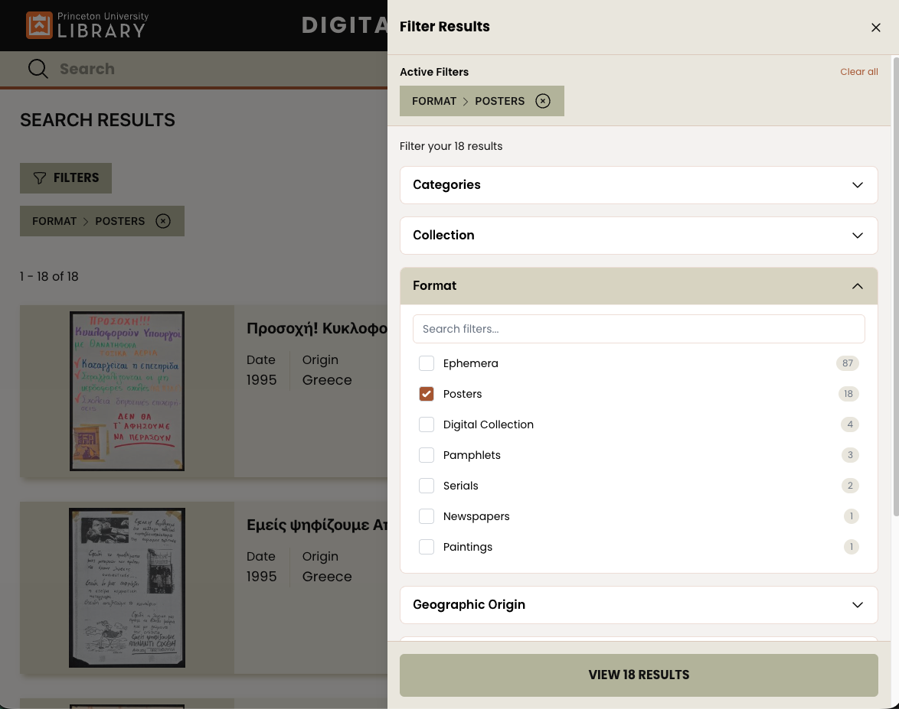

# 1. Filters

Date: 2026-03-30

## Status

Accepted 2026-03-30

## Context

Filters (or "facets" in common library vocabulary) are an oft-discussed feature to restrict a search result's items.

### User Testing to Keep in Mind:

Many of the conclusions here came from excellent testing from [CRKN-RCDR Blacklight Search UX Research](https://crkn-rcdr.gitbook.io/user-centered-design#facet-listing)

1. Patrons generally do not like paging through filters.
1. Filters are often missed - patrons expect keyword searches to be robust.

### Use Cases

1. A patron has come to a librarian asking for a specific and restricted set of material, and only those materials should come back via a URL sent to them. For example: "1970s cuban posters"
2. I've found search results based on keywords and would like to get an idea of the spread of my results - what subjects are most common, what collections might I do more research in?

### Design Guidelines

Filter design should:

1. Be accessible
2. Allow for an arbitrarily large set of possible filters
3. Be searchable using a browser's built in text search or through a UI element.
4. Make it very clear what the results of selecting a filter is.
5. Work similarly in both mobile and desktop.
6. Not overwhelm the casual keyword search experience - be an opt in enhancement rather than an expected interaction.

## Decision

Filters will:

1. Be initiated by a "Filters" button
1. Open a drawer from the right with all possible filters, a preview of how many results there will be, and all active filters.
1. Display active filters when the drawer is either open or closed.
1. Display all available options in each filter group, with a search bar to find relevant ones.

## Consequences

Choosing to place filters behind a button will mean that we should work to improve the keyword search functionality as a priority.

Allowing an infinite number of filters may result in overwhelm from the opt-in filter interface.

Loading many filters during every search will likely have a performance impact.
