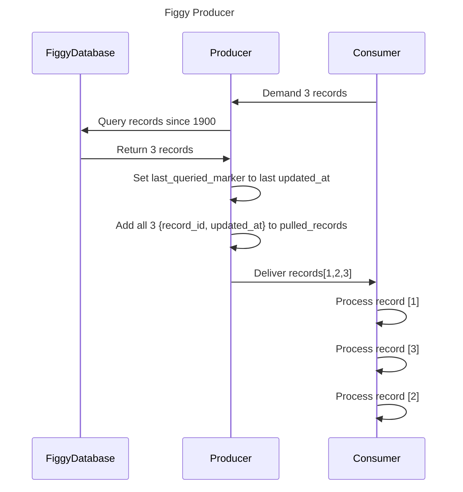

```mermaid
sequenceDiagram title Figgy Producer
Participant FiggyDatabase
Participant Producer
Participant Consumer

Consumer->>Producer: Demand 3 records
Producer->>FiggyDatabase: Query records since 1900
FiggyDatabase->>Producer: Return 3 records
Producer->>Producer: Set last_queried_marker to last updated_at
Producer->>Producer: Add all 3 {record_id, updated_at} to pulled_records
Producer->>Consumer: Deliver records[1,2,3]
Consumer->>Consumer: Process record [1]
Consumer->>Consumer: Process record [3]
Consumer->>Consumer: Process record [2]
```