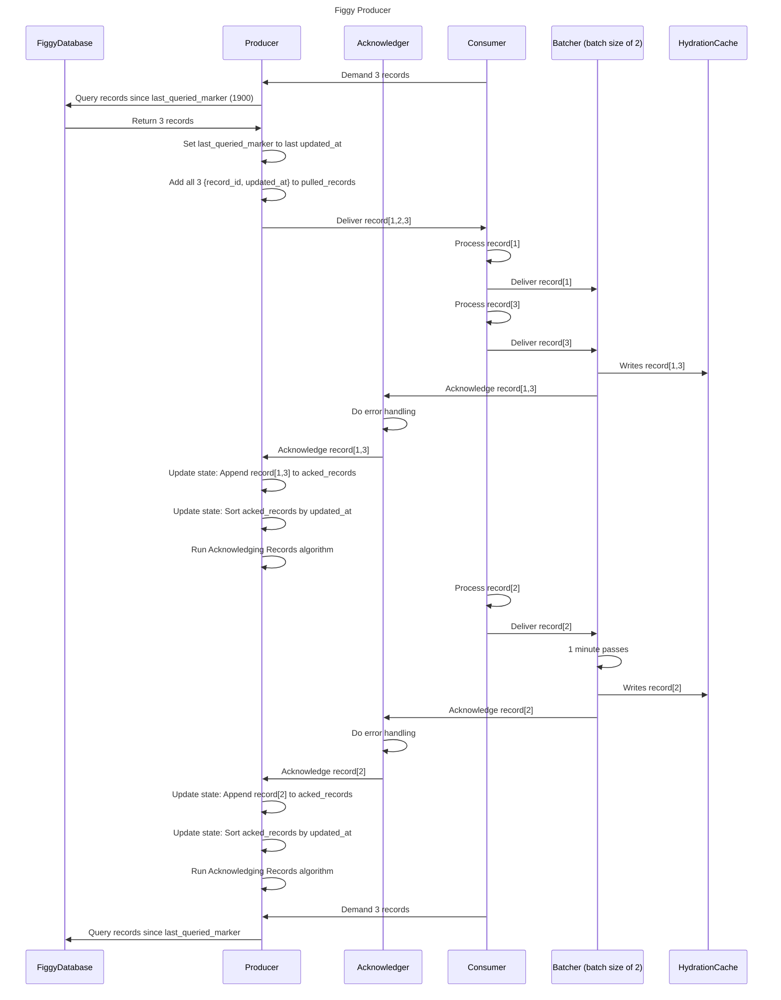

When Producer spins up, initialize last_queried_marker from the ProcessorMarkers table, or set it to 1900.

## Managing Producer State

### Acknowledging Records

When receiving acknowledgement for [1,3]:

Start state: `{last_queried_marker: record[3].updated_at, pulled_records: [1,2,3], acked_records: [1,3]}`

If the first element is the same in pulled_records and acked_records, then remove that element from both. Repeat until there's no match. Then write the timestamp from the last element that got removed from pulled_records.

The processor will block during this acknowledgement, so you don't have to worry about race conditions here.

End State: `{last_queried_marker: record[3].updated_at, pulled_records: [2,3], acked_records: [3]}`

Write `1.updated_at` to `ProcessorMarkers`

When receiving Acknowledgement for [2]:

Start State: `{last_queried_marker: record[3].updated_at, pulled_records: [2,3], acked_records: [2,3]}`

End State: `{last_queried_marker: record[3].updated_at, pulled_records: [], acked_records: []}`

Write `3.updated_at` to `ProcessorMarkers`
