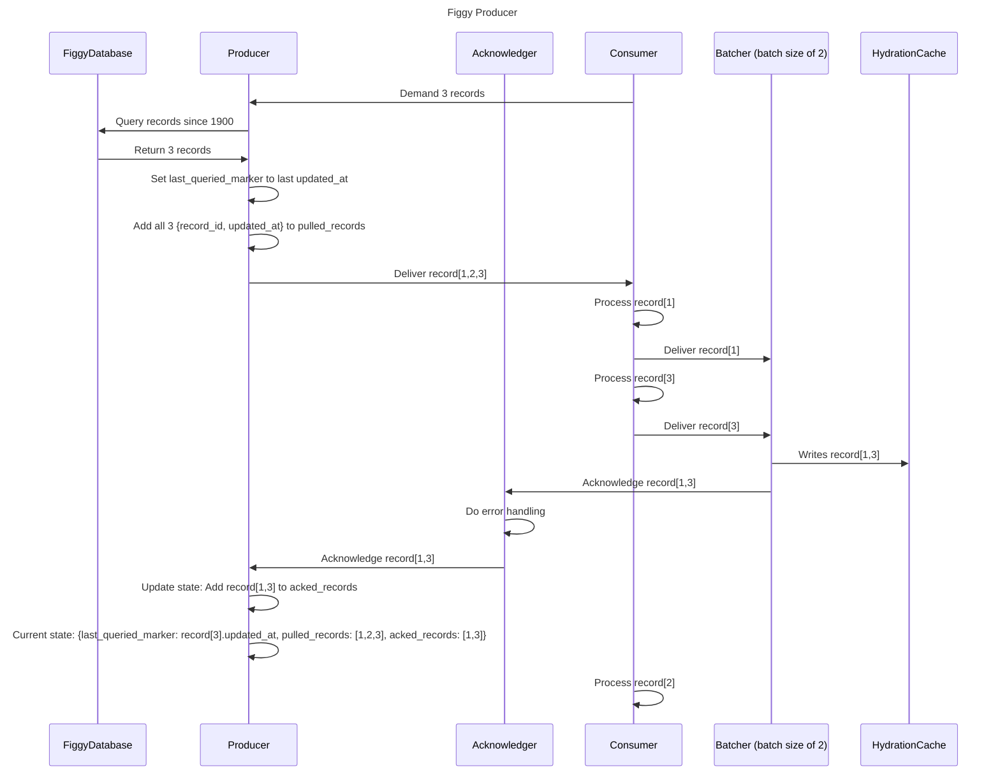

```mermaid
sequenceDiagram title Figgy Producer
Participant FiggyDatabase
Participant Producer
Participant Acknowledger
Participant Consumer
Participant Batcher as Batcher (batch size of 2)
Participant HydrationCache

Consumer->>Producer: Demand 3 records
Producer->>FiggyDatabase: Query records since 1900
FiggyDatabase->>Producer: Return 3 records
Producer->>Producer: Set last_queried_marker to last updated_at
Producer->>Producer: Add all 3 {record_id, updated_at} to pulled_records
Producer->>Consumer: Deliver record[1,2,3]
Consumer->>Consumer: Process record[1]
Consumer->>Batcher: Deliver record[1]
Consumer->>Consumer: Process record[3]
Consumer->>Batcher: Deliver record[3]
Batcher->>HydrationCache: Writes record[1,3]
Batcher->>Acknowledger: Acknowledge record[1,3]
Acknowledger->>Acknowledger: Do error handling
Acknowledger->>Producer: Acknowledge record[1,3]
Producer->>Producer: Update state: Add record[1,3] to acked_records
Producer->>Producer: Current state: {last_queried_marker: record[3].updated_at, pulled_records: [1,2,3], acked_records: [1,3]}
Consumer->>Consumer: Process record[2]
```